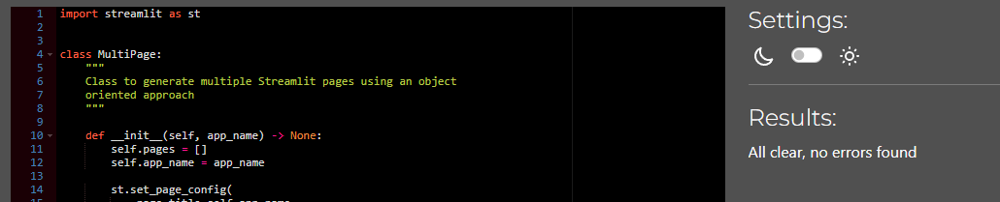
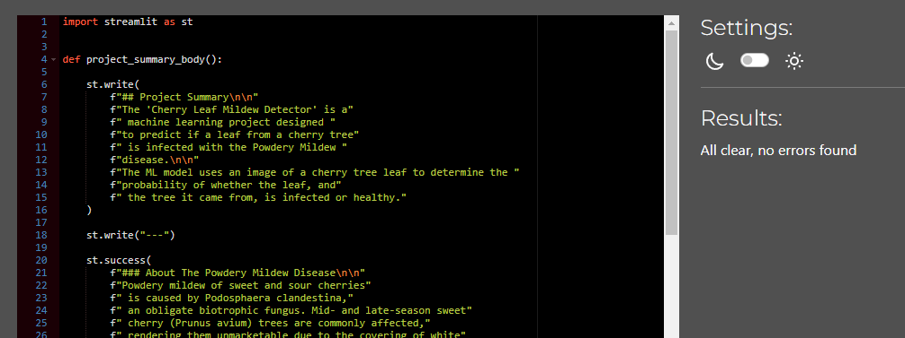
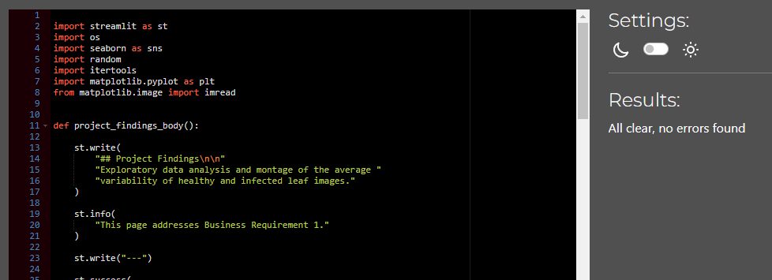
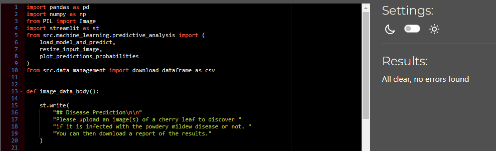
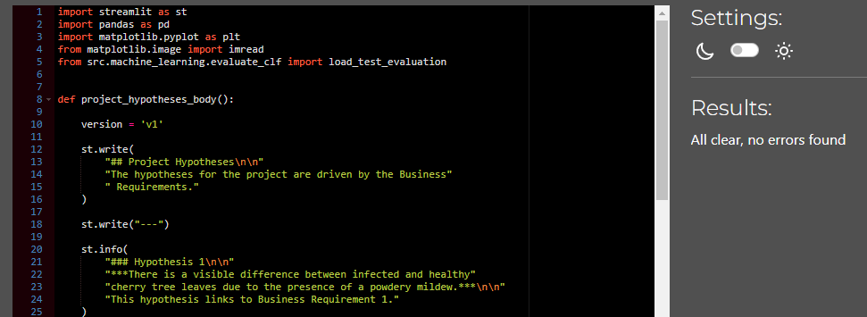
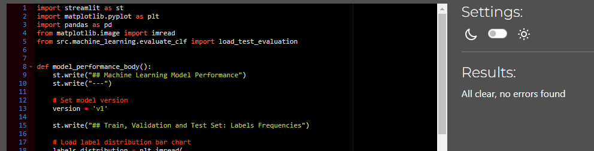
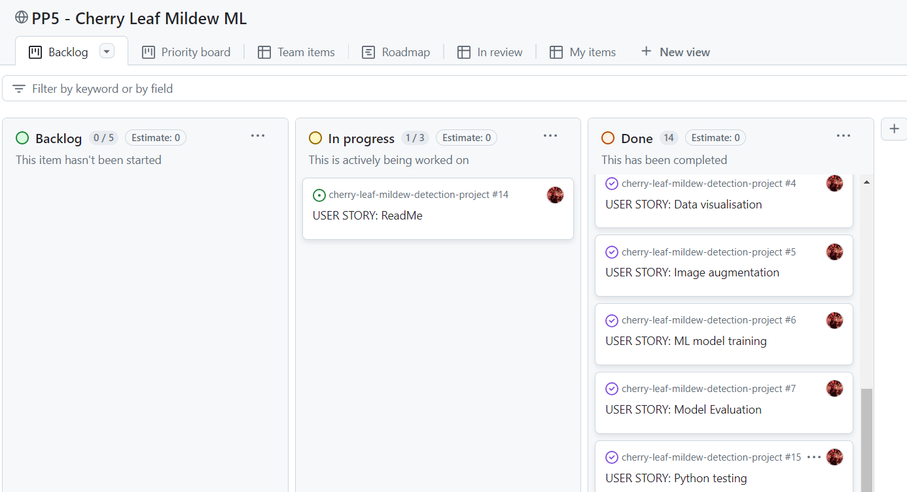
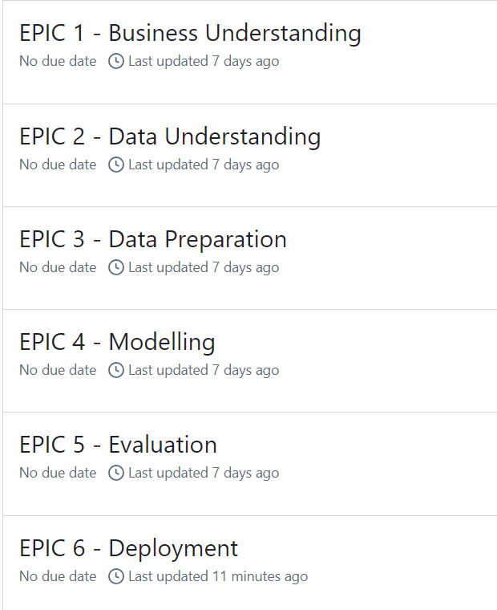
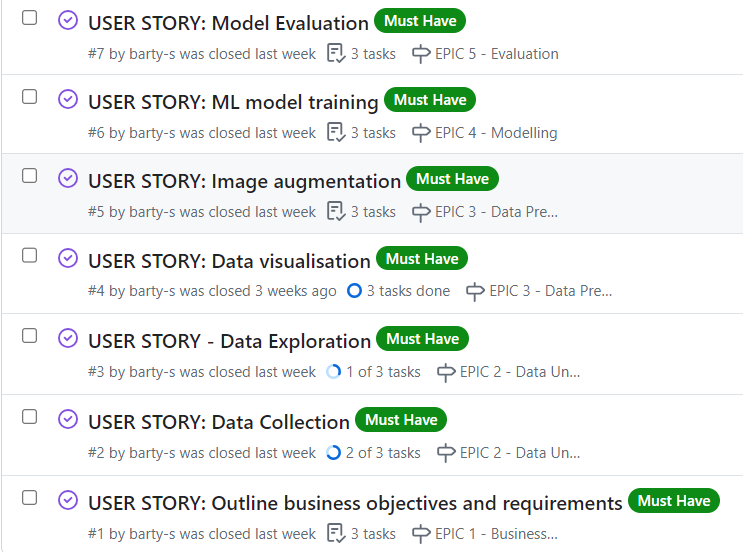
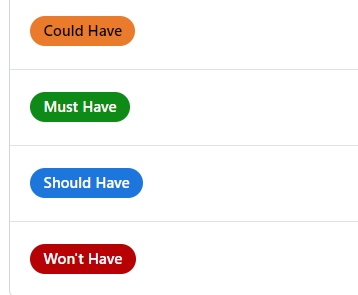

# Cherry Leaf Mildew Detection Project

This project employs machine learning to train a model to predict if a cherry tree leaf is infected or not.

## Business Requirements
The cherry plantation crop from Farmy & Foods is facing a challenge where their cherry plantations have been presenting powdery mildew. Currently, the process is manual verification if a given cherry tree contains powdery mildew. An employee spends around 30 minutes in each tree, taking a few samples of tree leaves and verifying visually if the leaf tree is healthy or has powdery mildew. If there is powdery mildew, the employee applies a specific compound to kill the fungus. The time spent applying this compound is 1 minute.  The company has thousands of cherry trees, located on multiple farms across the country. As a result, this manual process is not scalable due to the time spent in the manual process inspection.

To save time in this process, the IT team suggested an ML system that detects instantly, using a leaf tree image, if it is healthy or has powdery mildew. A similar manual process is in place for other crops for detecting pests, and if this initiative is successful, there is a realistic chance to replicate this project for all other crops. The dataset is a collection of cherry leaf images provided by Farmy & Foods, taken from their crops.

* 1 - The client is interested in conducting a study to visually differentiate a healthy cherry leaf from one with powdery mildew.
* 2 - The client is interested in predicting if a given cherry leaf is healthy or contains powdery mildew.

## Dataset Content
* The dataset is sourced from [Kaggle](https://www.kaggle.com/codeinstitute/cherry-leaves).
* The dataset contains over 4, 000 images taken from the client's crop fields. The images show healthy cherry leaves and cherry leaves that have powdery mildew, a fungal disease that affects many plant species. The cherry plantation crop is one of the finest products in their portfolio, and the company is concerned about supplying the market with a compromised quality product.

## Hypothesis and Hypothesis Validation

### Hypothesis 1
There is a visible difference between infected and healthy cherry tree leaves due to the presence of powdery mildew.

### Hypothesis 1 Validation: 
Conduct a study to visually differentiate a healthy leaf from an infected one. This will be done
with an average image study.

### Hypothesis 2
It is possible to train a model to predict, with at least **97%** accuracy, if a cherry tree leaf is infected with powdery mildew or not from an image of that leaf.

### Hypothesis 2 Validation:
The hypothesis will be tested by training a model on a train and a test set of images and by calculating the accuracy with a validation set of images.

## The rationale to map the business requirements to the Data Visualisations and ML tasks

The CRISP-DM workflow was utilised throughout this project to achieve satisfactory results for the two business requirements.

### Business Requirement 1
- An average image study was selected for this business requirement as it allows the client to see what an average healthy leaf looks like and what an average infected leaf looks like.
- An image montage was created to allow the user to peruse some examples of healthy and infected images.

### Business Requirement 2
- A machine learning model was selected to address the second business requirement. A binary classifier was used to determine if an image from the dataset was healthy or infected.
- An option to upload a new cherry leave image is also available to the user to allow them to use the trained model on unseen images and download a report afterwards.

## Machine Learning Business Case
- As the project requires prediction, an ML binary classification model was chosen to be trained.
- As the task is binary classification, a supervised, 2-class, single-label model with an Adagrad optimizer was chosen.
- The model was required to return a prediction accuracy of at least 97%. This was achieved with the selected model.
- By using this trained model, the workers at Farmy & Foods can take action on treating or removing, any infected cherry trees in order to protect their orchard from further infection and any potential revenue reductions.

## Dashboard Design
Streamlit Multipage was used to create a 5-page dashboard with a menu - select which page of the dashboard you want to view.

1. Project Summary page - contains blocks of information about the Business Requirements, the mildew disease, and the dataset.
2. Project Findings - contains 3 tick boxes the user can interact with to select to view the difference between an average leaf and the variability, to view the differences between average infected and average healthy leaves, or to view a montage of images of healthy and infected leaves selected at random from the dataset.
3. Image Data - contains a link to the dataset on kaggle.com, a widget to drag and drop an unseen image to be predicted on with the trained model and a widget to download a report on the prediction.
4. Project Hypotheses - this page contains blocks of information regarding the above-outlined project hypotheses and is supported with images of average healthy and infected leaves, as well as a report on the accuracy of the trained model.
5. Model Performance - this is a more technical page with images of plots outlining how the dataset was split for train, test and validation sets, and plots outlining how the model performed during training to reach the required level of >97% accuracy.

## Deployment
### Heroku

* The App live link is: https://cherry-leaf-mildew-detector-aec055e87e74.herokuapp.com/ 
* Set the runtime.txt Python version to a [Heroku-20](https://devcenter.heroku.com/articles/python-support#supported-runtimes) stack currently supported version.
* The project was deployed to Heroku using the following steps.

1. Log in to Heroku and create an App
2. At the Deploy tab, select GitHub as the deployment method.
3. Select your repository name and click Search. Once it is found, click Connect.
4. Select the branch you want to deploy, then click Deploy Branch.
5. The deployment process should happen smoothly if all deployment files are fully functional. Click now the button Open App on the top of the page to access your App.
6. If the slug size is too large then add large files not required for the app to the .slugignore file. 

## Main Data Analysis and Machine Learning Libraries
- NumPy - to work with data in arrays 
- Pandas - for data manipulation and analysis
- Matplotlib - for data visualisation
- Seaborn - for data visualisation
- Plotly - for graphs and plots
- Streamlit - for the app interface deployed on Heroku
- Scikit-learn - for predictive analysis
- Tensorflow - for model training

## Testing
### Python PEP-8
The python files in the app_pages directory were all tested with [Code Institute Python Linter](https://pep8ci.herokuapp.com/). All files have been tidied up to remove trailing white space and break up any lines with too many characters.

- Multi Page 

View result 

- Project Summary Page 

View result 

- Project Findings Page 

View result 

- Image Data Page 

View result 

- Project Hypotheses Page 

View result 

- Model Performance Page 

View result 

### Manual Testing
Follow this [link](TESTING.md) to view the results of the manual testing carried out on the Streamlit App pages.

## CRISP-DM
- The CRISP-DM approach was used to carry out this project.
- The project was planned using a GitHub projects Kanban board, with each stage of the project development broken into Epics and User Stories. 
- The MoSCoW approach for task prioritisation was also used.

## Credits
- [Code Institute](https://codeinstitute.net/ie/) - The 'Malaria Detector' walkthrough project assisted greatly in understanding the steps needed to achieve a trained ML model.
- Slack Community - for answers to questions regarding Jupyter notebook functionality, correct Heroku version installation and plot selection.
- [github.com/broken-helix/mildew-detector](https://github.com/broken-helix/mildew-detector?tab=readme-ov-file) - for help with the project's outline and model selection.
- [Treefruit.wsu.edu](https://treefruit.wsu.edu/crop-protection/disease-management/cherry-powdery-mildew/#:~:text=Powdery%20mildew%20of%20sweet%20and,1) - for information on the Powdery Mildew Disease.