# Streamlit App Pages 

## Manual Testing

| User Story                                                                                                                                                                                                                                                                                                                                                                                          	| Test Approach Summary                                                                                                                                                                                                                                                                                                                                                                                                                                                                                                                             	| Results                                            	|
|-----------------------------------------------------------------------------------------------------------------------------------------------------------------------------------------------------------------------------------------------------------------------------------------------------------------------------------------------------------------------------------------------------	|---------------------------------------------------------------------------------------------------------------------------------------------------------------------------------------------------------------------------------------------------------------------------------------------------------------------------------------------------------------------------------------------------------------------------------------------------------------------------------------------------------------------------------------------------	|----------------------------------------------------	|
| Streamlit App Page Menu: As a visiting user, I want to be able to see the menu of app  pages on every page so I can easily navigate between them.                                                                                                                                                                                                                                             	| On app load, the page menu is visible on the left hand side.  The menu is visible and collapsible on every page.  Clicking on the page name takes the user to the selected page.                                                                                                                                                                                                                                                                                                                                                            	| All links function correctly.  

View result 
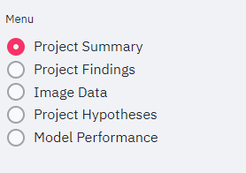
                    	|
| Project Summary Page: As a visiting user, I want to be able to read a summary of the project and learn more about the disease being tested for.                                                                                                                                                                                                                                               	| On app load, the Project Summary page displays correctly. All  text is visible and loading correctly.                                                                                                                                                                                                                                                                                                                                                                                                                                          	| Page loads without issues. 

View result 
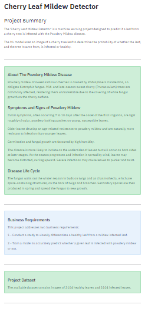
                         	|
| Project Findings Page: As a visiting user, I want to be able to learn about the findings for Business Requirement 1.  I want to see examples of the differences between average and variability images, to see examples of average healthy and infected  leaves and to see a montage of either healthy or unhealthy leaves.                                                          	| On page load, the user sees three tick boxes. On selecting the first tick box, the user will be able to view differences between  average and variability images. On selecting the second check box, the user will be able to see examples of average healthy and infected leaves. On selecting the third check box, the user will be able to select either 'healthy' or 'unhealthy' from a drop down list and then click on 'Create  Montage' to generate a montage of healthy or unhealthy images.                      	| All boxes and buttons function correctly.  

View result 
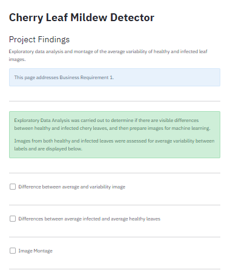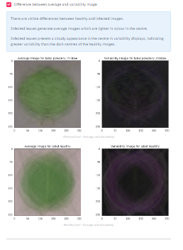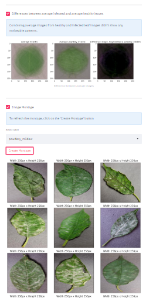
         	|
| Image Data Page: As a visiting user, I want to be able to download a set of  healthy and infected images to be predicted on by the model. I want to be able to upload one or multiple files for testing. I want to view the result so the model's prediction on the uploaded image(s) and be able to download a report of the results.                                               	| On page load, the user can click the link to download a set of images The user can then upload at least one image to be predicted on by the model. After predicting, the user can see the results and click a link to download a report.                                                                                                                                                                                                                                                                                                    	| All widgets, buttons and links function correctly. 

View result 
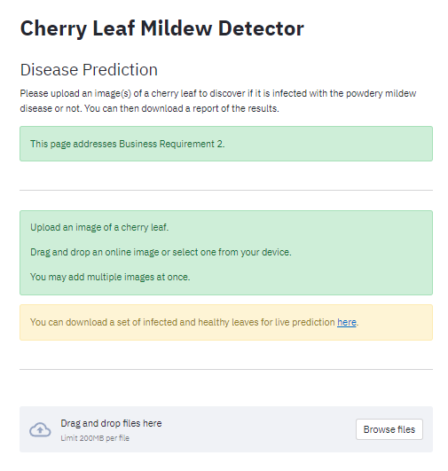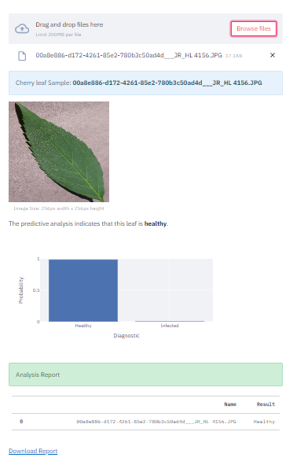
 	|
| Project Hypotheses Page: As a visiting user, I want to be able to read about the project's  two hypotheses and see example images of average healthy and unhealthy images and a result of prediction accuracy achieved after training the model.                                                                                                                                        	| On page load, the user can see a summary of Hypothesis 1 with images illustrating the average image and variability image of healthy and  unhealthy leaves. The user can then see a summary of Hypothesis 2 with the results of the model training.                                                                                                                                                                                                                                                                                      	| Page loads without issues. 

View result 
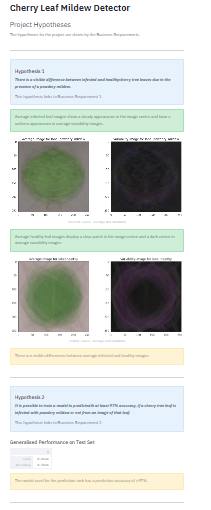
                       	|
| Model Performance Page: As a visiting user, I want to be able to see more technical details about the project including information on how the data was split into  train, test and validation sets, how the model was trained for accuracy and for loss and how many images were not predicted correctly and finally the  prediction accuracy result achieved after model training. 	| On page load, the user can see a bar chart and a pie chart illustrating how the  image dataset was split in to train, test and validation sets for ML purposes. The user then see line charts illustrating the history of the model training with  one chart outlining model accuracy and another outlining loss.  Next the user can see a confusion matrix outlining how many images were not predicted correctly by the model during training. Finally, the user can see the prediction accuracy resulting from the training. 	| Page and content load without issues. 

View result 
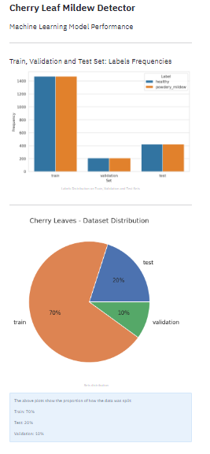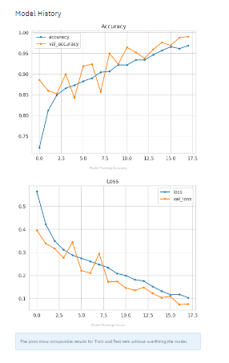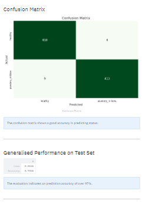
              	|

